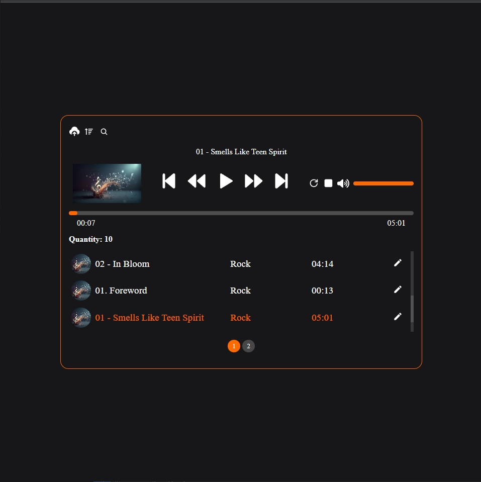
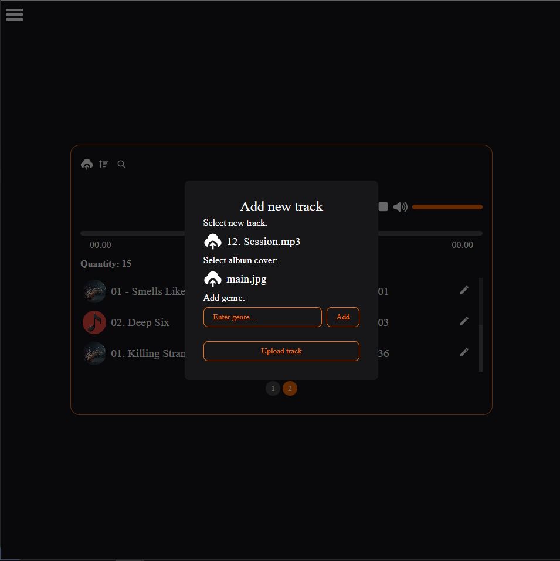
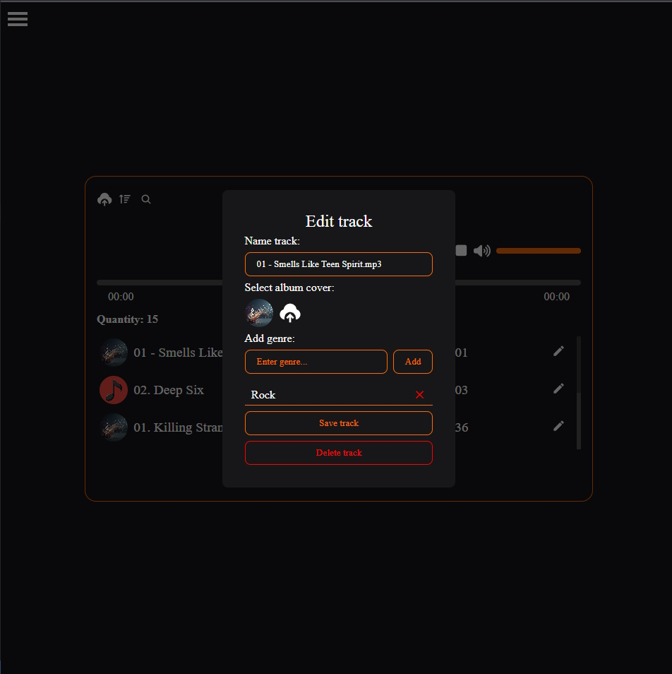

# Audio-player
Audio player is an application designed for convenient remote storage and listening to music on your device using PERN Stack.

#### Main page:


#### Create track:


#### Edit track:


## Installation Guide

### Requirements
- [Nodejs](https://nodejs.org/en/download)
- [PostgreSQL](https://www.postgresql.org/download/)

Both should be installed and make sure postgreSQL is running.

```shell
git clone https://github.com/xkz1899/audio-player.git
cd store
```

Install the dependencies.

```shell
cd server
npm install
cd ../client
npm install
cd ..
```
#### Create a database named "audio" in the database postgreSQL.

#### Start server.

```shell
cd server
npm start
```

#### Start client.

```shell
cd client
npm start
```

Now open http://localhost:3000 in your browser.
